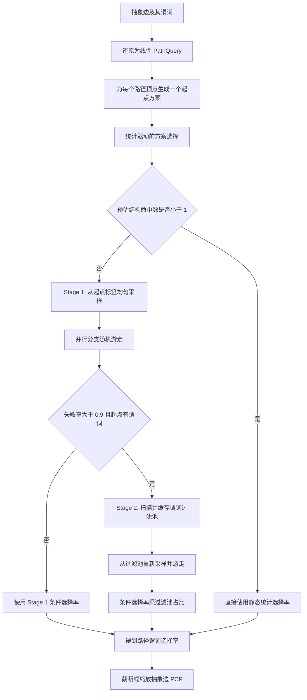

# GCard 采样逻辑、性能瓶颈与优化方案

> 基线范围：本文中的“原始实现”指本轮性能优化前的提交
> `2da9283c`（`Fix GCard sampling and singleton estimates`）。当前尚未提交的性能修改
> 作为“当前优化”单独介绍。

> 当前实现状态：原始 Stage 2 仅在第 1、2 节作为历史逻辑和瓶颈保留。当前执行路径
> 已取消全标签过滤池扫描，改为 Stage 1 加权选择率的单侧 95% 统计置信上界，详见
> 第 4.7 节。

## 1. 原始采样逻辑

GCard 的主体基数由 PCF（Piecewise Constant Function）估计。采样并不重新计算
完整结构基数，而是在抽象边包含谓词时，估计这条路径上谓词带来的选择率，并将
选择率应用到 PCF。

> 示例说明：除明确标注为历史日志或微基准的数据外，本文中的数字均为用于解释
> 算法的简化示例，不代表某个真实 LDBC 查询的测量结果。

### 1.1 总体流程



#### 贯穿全文的查询示例

假设查询路径为：

```text
(p1:person WHERE age >= 30)
    -[knows]->
(p2:person)
    -[isLocatedIn]->
(c:city WHERE name = "Beijing")
```

catalog/PCF 先估计不考虑谓词时，这个结构共有 1,200,000 个匹配。采样模块只负责
估计两个谓词联合成立的比例。假设采样得到选择率 `0.006`，最终基数就是：

```text
1,200,000 × 0.006 = 7,200
```

这说明采样结果是 PCF 的乘数，而不是对 1,200,000 个结构匹配做完整枚举。

### 1.2 路径编译与采样起点选择

一条包含 `k` 条边的路径会生成 `k + 1` 个候选方案，每个顶点都可以作为随机
游走起点。起点左侧的边按反方向遍历，右侧按原方向遍历。

方案选择不运行 pilot walk，而是使用已有统计：

- 谓词选择率：由 `FlatGraph` 的列统计估算，例如等值谓词约为 `1 / NDV`，范围
  谓词根据最小值和最大值线性估算。
- 结构参与率：由 GCard catalog 中的路径 PCF 估算一个标签顶点能够参与完整路径的
  概率。
- 可行性阈值：当 `sample_size × participation >= 5` 时，起点被视为可行。
- 在可行方案中优先选择谓词更强、结构参与率更高、标签规模更小的起点；如果没有
  可行方案，则优先选择结构参与率最高的起点。

如果最佳起点的 `sample_size × participation < 1`，实现会跳过几乎必然失败的
随机游走，直接使用列统计得到的静态谓词选择率。

#### 示例：如何选择起点

假设 `sample_size = 500`，三个候选起点的统计如下：

| 起点 | 标签规模 | 谓词选择率 | 结构参与率 | 预期结构命中数 | 是否可行 |
|---|---:|---:|---:|---:|---|
| `p1` | 1,000,000 | 0.10 | 0.40 | 200 | 是 |
| `p2` | 1,000,000 | 1.00 | 0.02 | 10 | 是 |
| `c` | 10,000 | 0.02 | 0.004 | 2 | 否 |

`c` 的谓词最强，但预期只能命中 2 个完整结构，低于可行阈值 5，因此不会优先。
`p1` 和 `p2` 都可行，其中 `p1` 的谓词更强，所以选择 `p1`。

如果最佳方案的参与率进一步下降到 `0.001`，则
`500 × 0.001 = 0.5 < 1`，pre-walk guard 会直接返回静态统计结果，不运行随机
游走。

### 1.3 Stage 1：均匀起点采样

Stage 1 从起点标签的所有顶点中无放回地抽取最多 `sample_size` 个顶点：

```text
label 的全部顶点 ID
        ↓ uniform sample without replacement
sampled_starts
        ↓ run_walk_batch
(sum_struct_weight, sum_pred_weight)
```

同一次 `gcard_query` 中，相同标签的起点样本缓存在 `flat_vertex_cache`，供不同
抽象边复用。

Stage 1 的条件选择率为：

```text
conditional = Σ predicate_weight / Σ structural_weight
```

失败率定义为 `1 - conditional`。当失败率大于 `0.9` 且起点本身带谓词时，进入
Stage 2。

#### 示例：Stage 1 为什么会触发 Stage 2

假设从 `person` 标签均匀抽取 500 个起点，聚合后的权重为：

```text
Σ structural_weight = 2,400
Σ predicate_weight  =   144
conditional         = 144 / 2,400 = 0.06
failure_rate        = 1 - 0.06 = 0.94
```

因为 `p1` 带有 `age >= 30` 谓词，且 `0.94 > 0.9`，实现会进入 Stage 2。这里使用
权重之比，而不是简单计算“500 个起点中有多少个成功”，是因为不同随机路径的
结构权重可能不同。

### 1.4 Stage 2：谓词过滤池重采样

Stage 2 会并行扫描起点标签的所有顶点，物化满足起点谓词的顶点列表：

```text
filtered_pool = {v | v 属于 start_label 且满足 start_predicates}
filter_ratio  = |filtered_pool| / |start_label|
```

过滤池使用“标签 + 完整谓词语义”作为 key，缓存在全局
`GLOBAL_FILTERED_POOL_CACHE` 中。随后从过滤池无放回采样，再执行同一套随机游走。

最终无条件选择率为：

```text
selectivity = conditional_on_filtered_pool × filter_ratio
```

如果过滤池为空，结果是真正的零；如果过滤池非空但有限样本没有命中，代码使用
静态列统计作为 fallback，避免一次 sampling miss 把 PCF 结构基数错误压成零。

#### 示例：Stage 2 如何去偏

假设 `person` 标签共有 1,000,000 个顶点，其中 20,000 个满足起点谓词：

```text
filter_ratio = 20,000 / 1,000,000 = 0.02
```

从这 20,000 个顶点中重采样后，假设完整路径上其他谓词的条件选择率为 `0.30`，
那么无条件选择率为：

```text
selectivity = 0.30 × 0.02 = 0.006
```

回到贯穿示例，最终基数为 `1,200,000 × 0.006 = 7,200`。如果忘记乘
`filter_ratio`，就会错误返回 `1,200,000 × 0.30 = 360,000`。

### 1.5 单个起点上的分支随机游走

`run_walk_batch` 以 128 个起点为一批，通过 Rayon 并行处理。每个起点拥有独立的：

- 随机数生成器；
- 邻居缓存；
- 谓词判断缓存；
- profiling 计数器。

游走到一个出度为 `d` 的边步骤时，使用 Alley 风格的分支采样：

```text
b = 1 / 32
k = clamp(ceil(b × d), 1, d)
```

从 `d` 个邻居中无放回抽取 `k` 个，递归估计后续路径，再使用
Horvitz–Thompson 形式恢复总量：

```text
estimated_weight = d × average(sampled_branch_weights)
```

顶点和边谓词分别作用于 predicate weight；structural weight 只反映路径结构。

#### 示例：一次分支采样如何恢复总量

假设当前顶点出度 `d = 100`：

```text
k = ceil(100 / 32) = 4
```

随机抽到 4 个邻居，它们后续路径的 structural weight 分别是
`[0, 2, 1, 1]`，predicate weight 分别是 `[0, 1, 0, 1]`。则：

```text
structural estimate = 100 × average(0, 2, 1, 1) = 100
predicate estimate  = 100 × average(0, 1, 0, 1) = 50
conditional         = 50 / 100 = 0.5
```

虽然只展开了 4 个邻居，`degree × sample average` 仍把结果恢复到了 100 个邻居的
尺度。

### 1.6 自适应 walk 数量与提前停止

原始实现不是简单地为每个起点固定运行 50 次：

- 无谓词、可精确计算的方案：每个起点只运行 1 次。
- 其他方案：先运行 5 次 pilot walk。
- pilot 的结构权重变异系数 `CV > 0.3` 且 `CV <= 3.0` 时，补到 50 次。
- 无谓词的路径段优先用 BFS 精确计算可达路径数；中间 frontier 超过 200,000 时
  才回退到随机游走。
- 全局累计至少 300 个结构成功起点后，使用 Delta method 估算选择率的 95% 置信
  区间；相对半宽不超过 10% 时提前停止。
- 结构成功起点最多累计 4,000 个。

#### 示例：什么时候只做 5 次，什么时候扩到 50 次

如果某个起点的 5 次 pilot structural weight 为：

```text
[80, 84, 79, 82, 81]
```

这些值非常集中，CV 远小于 `0.3`，所以该起点停在 5 次。如果结果为：

```text
[0, 20, 200, 5, 100]
```

结构权重波动明显，CV 落在 `(0.3, 3.0]` 时就会补到 50 次。全局层面，如果累计
384 个结构成功起点后估计选择率为 `0.05`，95% 置信区间半宽为 `0.004`，相对半宽
为 `0.004 / 0.05 = 8%`，低于 10%，后续起点便不再处理。

### 1.7 原始实现已经具备的优化

原始实现并非完全没有优化，已经包括：

- FlatGraph/CSR 读取路径，避开 MVCC 和事务开销；
- 统计驱动的起点方案选择；
- 低结构参与率 pre-walk guard；
- Stage 1/Stage 2 的按需升级；
- 全局过滤池缓存、查询内选择率缓存和起点样本缓存；
- 线程本地谓词缓存，结束后再合并到 DashMap；
- 无谓词段精确计数；
- per-start CV 自适应和全局置信区间提前停止；
- Rayon 批量并行。

## 2. 性能瓶颈

### 2.1 候选池抽样复制整个输入

原始的 `sample_without_replacement` 执行：

```rust
let mut buf = values.to_vec();
let (selected, _) = buf.partial_shuffle(rng, amount);
selected.to_vec()
```

虽然 `partial_shuffle` 本身只需要处理约 `k` 个元素，但调用前先复制了全部 `N`
个候选，之后又复制 `k` 个结果。因此，从百万顶点中抽 500 个仍然需要复制百万
顶点。

常见的 `k << N` 场景中：

- 时间复杂度由理想的近似 `O(k)` 退化为 `O(N + k)`；
- 临时内存由 `O(k)` 变成 `O(N + k)`；
- 大标签和 Stage 2 大过滤池会受到内存带宽和 allocator 的明显影响。

#### 示例：抽 500 个顶点实际复制了多少数据

`VertexId` 是 8 字节。若从 1,000,000 个顶点中抽 500 个：

```text
完整候选池副本 = 1,000,000 × 8B ≈ 7.63 MiB
最终样本       =       500 × 8B ≈ 3.91 KiB
```

原始实现为了得到约 4KiB 的结果，每次先复制约 7.63MiB。若一个查询有 10 条不能
命中 selectivity cache 的抽象边，仅这一项就可能搬运约 76MiB 数据。

### 2.2 高出度分支存在多层重复复制

原始分支游走在一个邻居步骤上依次执行：

1. CSR 邻居 slice 首次访问时 `to_vec()`，复制到 per-start 缓存；
2. 每次递归调用从缓存中 `clone()` 完整邻居 `Vec`；
3. 创建完整的 `(0..degree)` 索引 `Vec`；
4. `sample_without_replacement` 再复制完整索引 `Vec`；
5. 最后保留约 `degree / 32` 个索引。

因此，即使只使用约 3.125% 的邻居，也会反复复制接近 100% 的邻居和索引。

#### 示例：高出度节点的重复复制

假设 `degree = 32,768`，默认分支数 `k = 1,024`，每个 `(VertexId, EdgeId)` 为
16 字节：

```text
完整邻居 Vec 约为 512 KiB
完整 usize 索引 Vec 约为 256 KiB
真正需要的 1,024 个邻居仅为 16 KiB
```

在一次缓存命中的递归调用中，原始实现仍会复制完整邻居 Vec，并建立、再次复制
完整索引 Vec；真正用于递归的数据只占其中很小一部分。

### 2.3 邻居缓存命中仍然分配字符串

原始邻居缓存 key 为：

```text
(current_label: String, vertex_id, edge_label: String, outgoing)
```

每次 walk step 都会执行 `to_string()` 和 `clone()`。即使缓存命中，两个字符串的
分配、复制、哈希仍然会发生。随后代码还执行 `contains_key` 和 `get`，同一个 key
通常需要两次 HashMap 查找。

#### 示例：缓存命中为什么仍然昂贵

对于固定步骤 `person -[knows]-> person` 和起点 `vid = 42`，同一 pilot 的 50 次
walk 会重复构造近似如下的 key：

```text
("person".to_string(), 42, "knows".to_string(), true)
```

邻居列表可能从第 2 次起全部命中，但两个字符串的分配和哈希仍会发生 50 次。缓存
只省掉了 CSR 读取，没有省掉访问缓存本身的成本。

### 2.4 采样总耗时的大部分没有被邻居和属性计时解释

历史日志中的一个例子 `q3_01`：

```text
sample_time = 0.104078 s
nbr_time    = 0.0091 s
prop_time   = 0.0127 s
```

邻居访问和属性访问合计约 21.8ms，仍有约 82.3ms（约 79%）位于当前细分计时之外。
这部分主要包括：容器复制与分配、缓存 key 构造和哈希、随机数生成、Rayon 调度、
递归、聚合及日志输出。这个例子不能代表所有查询，但说明只优化 CSR 读取不足以
解决总体采样耗时。

### 2.5 walk 数量仍可能过多

- per-start 自适应只有“5 次或 50 次”两档，CV 超过阈值后直接补 45 次，没有在
  10、20、30 次等中间阶段重新判断。
- CV 依据 structural weight，而最终目标是 `predicate_weight / structural_weight`；
  两者的方差目标并不完全一致。
- 全局提前停止按 128 个起点的 batch 检查，接近收敛时最多可能多做 127 个起点。
- Stage 2 的触发依据整条路径的条件失败率，却只物化起点谓词过滤池。下游谓词
  失败也可能错误地推动 Stage 2，造成一次无收益的全标签扫描。
- 固定 `b = 1/32` 对不同度分布、路径长度和谓词位置并不总是最优。

### 2.6 Stage 2 的全标签扫描和缓存问题

- 首次遇到一个新谓词组合时必须扫描整个标签，复杂度为 `O(|label|)`。
- 全局过滤池缓存没有容量上限；ad-hoc 谓词多时可能长期占用大量内存。
- 并发查询同时 miss 同一个 key 时，可能重复扫描同一标签。
- 图发生更新后，过滤池需要明确的数据版本或失效机制，否则可能读到陈旧结果。
- cache key 构建需要复制 `ScalarValue`、字符串并排序谓词规格。

### 2.7 per-start 分配、哈希和共享缓存合并

每个采样起点都会新建邻居 HashMap、谓词 HashMap、两个 walk weight Vec 和 RNG
handle。处理完后又把本地谓词结果逐项写入共享 DashMap。起点多、pilot walk 多时：

- 小对象分配和释放频繁；
- 默认 HashMap 对整数复合 key 的哈希成本偏高；
- 大量共享 DashMap 插入可能超过复用带来的收益；
- batch 结果先收集成 Vec，再串行聚合，增加中间内存和一次遍历。

### 2.8 FlatGraph 热路径仍包含字符串和 HashMap 查找

即使邻居缓存 key 得到优化，cache miss 时
`neighbors_with_eid_for_label` 仍会构造：

```text
(vertex_label.to_string(), edge_label.to_string(), outgoing)
```

然后查询 `hop_csrs`。编译后的路径步骤仍保存多个 `String`，而不是数字 label/hop ID
或预解析 CSR handle。

### 2.9 属性访问和谓词执行仍是动态路径

- 顶点/边属性由 ID 查找，再从 `Vec<ScalarValue>` 中按位置访问；
- `ScalarValue` 和 `ComparisonOp` 每次都经过动态枚举分派；
- 多个谓词没有根据成本或淘汰率调整执行顺序；
- 高频等值/范围谓词没有 bitmap、倒排或排序列索引，只能逐顶点判断。

### 2.10 profiling 与日志自身有成本

- 邻居和属性路径频繁调用 `Instant::now()`；
- 原始实现中，每个起点结束后分别执行多个 atomic counter 更新；
- 原始实现中，`[selectivity-debug]` 为无条件 `eprintln!`，大量抽象边或查询会产生明显 I/O，
  并且这段输出位于选择率采样计时区间内。

## 3. 可以优化的点

下面列出当前代码中可识别的主要优化方向。“收益”是定性预估，最终必须由
端到端 workload 验证。

### 3.1 P0：优先实施

| 优化项 | 方法 | 主要收益 | 风险/注意事项 | 状态 |
|---|---|---|---|---|
| 候选池 `O(k)` 抽样 | 使用 `rand::seq::index::sample`，只克隆被选中的元素 | 大标签和大过滤池显著降内存流量 | 随机序列会改变，但仍是均匀无放回采样 | 已实现 |
| 分支邻居零复制 | 直接借用 CSR row；`k=1` 直接抽索引，`k=d` 直接遍历，其余仅保存 `k` 个索引 | 常见低度数和全展开场景零临时分配，高出度也不复制邻居 tuple | 递归必须与 CSR 引用生命周期兼容 | 已实现 |
| 数字化邻居缓存 key | 编译步骤分配 `cache_slot`，key 改为 `(slot, vid)` | 消除缓存命中时的字符串分配和长 key 哈希 | 必须保证 slot 在单个编译方案内唯一 | 已实现 |
| 单次 HashMap entry 查找 | 使用 `entry` 同时完成 hit/miss 和插入 | 去掉 `contains_key + get` 双查找 | 无明显算法风险 | 已实现 |
| 关闭默认 debug 输出 | 将 `[selectivity-debug]` 放到 `GCARD_VERBOSE` 之后 | 直接消除热路径同步 I/O | 仍保留显式实验可观测入口 | 已实现 |
| 固定 walk 结果缓冲 | 使用两个 `[f64; MAX_WALKS]` 保存每起点结果 | 消除每个起点的两个堆分配，累加顺序不变 | 每个 Rayon 任务增加约 800 字节栈空间 | 已实现 |
| 起点谓词只计算一次 | 在 per-start walk 循环外求值并传入每次 walk | 去掉同一起点 5–50 次局部 HashMap 探测 | 必须保持 missing-property 的结构失败语义 | 已实现 |
| 删除无读取方的共享 predicate flush | Stage 1 只保留每起点局部谓词缓存 | 去掉每个起点结束时的 DashMap 插入与竞争 | 若未来恢复跨起点读取，需要重新评估 | 已实现 |
| 聚合 profiling 原子更新 | 每个 batch 汇总后对三个计数器各更新一次 | 原子写从每起点三次降到每批次三次 | profiling 统计值保持不变 | 已实现 |
| 取消 Stage 2，使用统计置信上界 | 只运行均匀 Stage 1；基于结构权重的 Kish 有效样本数计算单侧 95% 上界 | 完全消除查询期全标签扫描和过滤池物化 | 这是统计上界而非无假设的确定性上界 | 已实现 |
| 分阶段 per-start 自适应 | 5→10→20→50 次逐级检查，而不是 5→50 | 高方差边界场景减少无效 walk | 停止规则必须避免偏差 | 待实现 |
| 自适应全局 batch | 前期大 batch，接近收敛后缩小到 16/32 | 减少最多 127 个起点的收敛 overshoot | Rayon 小任务调度成本需一起衡量 | 待实现 |

#### 示例：为什么需要分离 Stage 2 触发信号

假设起点谓词通过率为 80%，但路径末端的 `city.name = "Beijing"` 通过率只有 5%。
整条路径条件通过率约为 `0.8 × 0.05 = 0.04`，当前逻辑得到 96% 失败率，因此触发
Stage 2。然而物化起点过滤池只能去掉 20% 的起点，无法解决末端谓词造成的主要
失败，扫描整个 `person` 标签很可能得不偿失。

如果分别记录：

```text
structural dead-end rate = 2%
start predicate fail     = 20%
downstream predicate fail= 95%
```

就可以识别出瓶颈在下游谓词，从而跳过无收益的起点过滤池物化。

### 3.2 P1：高价值结构优化

| 优化项 | 方法 | 主要收益 | 风险/注意事项 |
|---|---|---|---|
| 预解析 CSR handle（已实现） | 编译方案时把 label/edge/direction 解析成 CSR 引用 | cache miss 也不再创建字符串和查三元组 HashMap | 当前 compiled plan 只能在对应 FlatGraph 的借用期内使用 |
| 避免邻居缓存复制 CSR row（已实现） | 缓存 CSR row offset range，由预解析 CSR 零复制读取 | 去掉首次访问的 `slice.to_vec()` 和大量 per-start 内存 | range 必须与所属 CSR 的 cache slot 一一对应 |
| 借用完整候选池 | 当 `sample_size >= pool.len()` 时传 slice/Cow，而不是复制全部元素 | 小标签或高采样率避免无意义复制 | API 需要同时支持 borrowed/owned starts |
| worker-local 对象复用（部分实现） | Rayon `map_init` 已复用两个 HashMap 的容量；RNG 和其他缓冲仍可继续复用 | 降低每个起点的 allocator 成本 | 必须在起点之间正确清空逻辑状态 |
| 流式聚合 batch 结果 | 使用 Rayon reduce/fold 聚合权重和 profiling，避免 `Vec<(result, prof)>` | 减少中间分配和串行遍历 | 提前停止仍以 batch 为边界 |
| 聚合 profiling 更新 | 每个 batch 汇总后仅做一次 atomic update（已实现）；生产构建关闭细粒度 timer（待实现） | 减少 timer 和 atomic 开销 | profiling 数据粒度降低 |
| 更合适的整数 key 容器 | 使用快速 hasher、dense map、slot-indexed Vec 或小型线性缓存 | 降低 neighbor/predicate cache 哈希成本 | 新依赖和 DoS 安全边界要评估 |
| 直接估计目标方差 | per-start 和全局停止规则围绕 ratio 的 Delta-method SE，而非只看 structural CV | 用更少 walk 达到相同选择率误差 | 数值稳定性和零分母处理更复杂 |
| 自适应 branching factor | 根据 degree、剩余路径长度、谓词位置、历史方差选择 `k` | 控制分支爆炸，同时降低方差 | 必须保持 Horvitz–Thompson 权重正确 |
| 概率化 pre-walk guard | 使用 `P(no hit)=(1-p)^n` 和目标成功数代替固定 `<1` 阈值 | 更稳定地跳过 doomed walk | participation 本身是估计值 |
| 谓词执行顺序优化 | 先执行便宜且高淘汰率的谓词 | 更早终止属性判断 | 需要谓词成本/选择率统计 |

### 3.3 P1：如果未来重新引入谓词索引

当前查询执行已经不再使用过滤池。下表保留为未来需要精确谓词支持度时的备选设计，
不属于当前运行路径。

| 优化项 | 方法 | 主要收益 | 风险/注意事项 |
|---|---|---|---|
| 谓词 bitmap/索引 | 为常用等值和范围谓词构建 bitmap、倒排或排序列索引 | 未来可提供比置信上界更精确的谓词支持度，不需要全标签扫描 | 建索引时间、更新维护和内存成本 |
| 过滤池 single-flight | 用 entry + OnceLock/初始化状态保证同一 key 只扫描一次 | 避免并发 cache miss 重复工作 | 失败传播和锁粒度 |
| 有界且版本化的过滤池缓存 | LRU/容量上限，并把 graph/catalog version 放入 key | 控制内存并保证更新后正确失效 | eviction 策略会影响命中率 |
| typed predicate key | 使用结构化 hash key 和预计算 predicate signature，避免格式化、重复排序和深拷贝 | 降低 cache key 构建成本 | `ScalarValue` 的 Hash/Eq 语义要统一 |
| 跨查询选择率缓存 | 对 path + predicate + graph version 缓存最终选择率 | 重复 workload 可以完全跳过采样 | 必须有容量和更新失效策略 |
| 位图化谓词结果缓存 | 对稳定 predicate 使用 label-local bitset，代替 `(predicate_id, vid)` DashMap | 更紧凑、更快、无逐项哈希 | predicate ID 生命周期和稀疏域处理 |
| 减少共享缓存回写 | 先统计复用价值，仅合并热点 predicate；或使用 batch/shard-local cache | 降低 DashMap 插入成本 | 可能增加少量重复谓词计算 |

#### 示例：bitmap 如何替代 Stage 2 全扫描

假设一百万个 `person` 顶点中有 20,000 个满足 `country = "CN"`。当前首次查询需要
逐顶点读取属性并比较一百万次。若该等值谓词已有 bitmap，Stage 2 可以直接读取
20,000 个置位位置；多个谓词则执行 bitmap AND。例如：

```text
country_CN_bitmap AND age_ge_30_bitmap
```

这样查询成本更接近 bitmap 长度和结果规模，但代价是导入、更新时需要维护索引，
并消耗额外内存。

### 3.4 P2：数据布局和执行器重构

| 优化项 | 方法 | 主要收益 | 风险/注意事项 |
|---|---|---|---|
| 数字化 compiled plan | label、edge 和 predicate 全部预解析成紧凑 ID/直接索引 | 消除热路径 String 和多层 HashMap | 改动面较大 |
| 列式属性存储 | 按 label/property 使用 typed array，通过 dense vertex offset 访问 | 属性读取和比较更适合缓存与 SIMD | FlatGraph 构建和更新逻辑需调整 |
| 编译类型专用谓词 | 将 `ScalarValue + ComparisonOp` 编译为类型专用 evaluator | 减少每次枚举分派和转换 | 需覆盖所有类型和 NULL 语义 |
| 迭代式 walk 状态机 | 用显式栈/arena 替代递归函数和大量短生命周期 Vec | 降低函数调用和分配，便于批量执行 | 实现复杂、需严谨验证权重 |
| 批量/向量化多起点 walk | 同一步骤同时处理一批起点，按 CSR 和属性列批量读取 | 改善 locality，可能支持 SIMD | 分支路径发散处理复杂 |
| 缓存无谓词段可达计数 | 按 segment signature + start vertex 缓存 BFS 结果 | 重复路径/查询跳过 BFS | 结果缓存可能很大，必须版本化 |
| BFS 成本模型 | 根据 degree/PCF/frontier 预估决定 exact BFS 或 sampling | 避免精确计数 frontier 爆炸 | 成本模型需要 workload 校准 |
| unit-path 共享执行 | 多个 unit hop 合并扫描或复用同一批 starts/属性结果 | 减少 `unit_selectivity_walks` 重复成本 | 相关性和选择率组合语义需验证 |
| 避免嵌套并行和过度调度 | 为查询级和 walk 级并行设置统一线程池及串行阈值 | 小查询更快，大查询更稳定 | 需要按机器核数调参 |

### 3.5 建议实施顺序

建议按以下顺序推进（前四项中的工程热路径部分已经完成）：

1. 完成 P0 的日志开关和容器优化；取消 Stage 2，以加权单侧置信上界处理低命中和
   零命中（已完成）。
2. 增加端到端 profiling 字段：起点抽样、RNG、cache key、邻居缓存、predicate cache
   flush、Rayon 和日志分别计时；确认过滤池 scan 在当前路径中恒为零。
3. 预解析 CSR handle，并让邻居缓存保存 row range/handle，消除剩余字符串和完整邻居复制（已完成）。
4. 引入 worker-local buffer/RNG 复用和流式聚合（HashMap 容量复用已完成，其余待评估）。
5. 根据真实 workload 决定是否值得建设 predicate bitmap/索引。
6. 最后再考虑列式属性和批量 walk 等大范围重构。

## 4. 当前已经完成的优化

### 4.1 候选池从复制 `N` 个改为只复制 `k` 个

当前实现使用 `rand::seq::index::sample` 先生成 `k` 个不重复随机索引，再仅克隆
对应元素：

```rust
index::sample(rng, values.len(), amount)
    .into_iter()
    .map(|idx| values[idx].clone())
    .collect()
```

这项修改覆盖：

- Stage 1 的 label 顶点采样；
- 单顶点谓词估计的候选抽样。

当 `k << N` 时，元素复制和结果内存从 `O(N + k)` 降为近似 `O(k)`。当
`k >= N` 时仍返回完整副本，保持原有 API 行为。

#### 示例：索引采样只读取选中位置

假设输入为：

```text
values = [10, 11, 12, 13, 14, 15, 16, 17, 18, 19]
amount = 3
```

`index::sample` 可能生成索引 `[7, 1, 4]`，最终只克隆：

```text
[values[7], values[1], values[4]] = [17, 11, 14]
```

不再先创建完整的十元素副本。真实输入为百万顶点时，逻辑完全相同。

### 4.2 分支游走直接借用 CSR 邻居

原始实现先 clone 完整邻居 Vec，再建立完整索引 Vec。当前实现直接借用预解析 CSR
中的邻居 slice，按照三种情况执行：

- `k = 1`：直接均匀生成一个索引，不分配临时 Vec；
- `k = degree`：顺序遍历借用的 CSR row，不采样、不分配；
- `1 < k < degree`：只生成 `k` 个无重复索引，邻居 tuple 仍不复制。

以默认 `b = 1/32` 为例，`degree <= 32` 时都属于最常见的 `k = 1` 零分配路径。
例如 `degree = 3,200` 时，`k = 100`，当前实现只保留 100 个紧凑索引，不再复制
3,200 个邻居，也不再复制选中的 100 个 `(VertexId, EdgeId)`。

### 4.3 预解析 CSR 与 range 邻居缓存

编译路径方案时，为每个 edge step 分配方案内唯一的 `cache_slot`。per-start 邻居
缓存 key 从：

```text
(String, VertexId, String, bool)
```

变为：

```text
(cache_slot: usize, VertexId)
```

一个邻居缓存只服务于一个 compiled plan，因此 slot 能唯一确定该步骤的 label、
edge label 和方向。缓存命中不再产生字符串分配。

编译阶段还会把 `(vertex_label, edge_label, direction)` 直接解析成不可变 CSR 引用。
热路径不再调用字符串 key 的 `hop_csrs` HashMap。首次访问 `(slot, vid)` 时只对 CSR
顶点表做一次二分查找，并缓存邻居范围：

```text
(slot, vid) -> (row_start, row_end)
```

后续 walk 用该范围直接借用 CSR row。缓存 value 从完整
`Vec<(VertexId, EdgeId)>` 缩小为两个 `usize`，并使用 HashMap `entry` 一次完成
hit/miss 和首次插入。

#### 示例：同一方案内的 slot

贯穿示例编译后可以得到：

```text
slot 0 = person -[knows]-> person
slot 1 = person -[isLocatedIn]-> city
```

当 `vid = 42` 访问第一步时，缓存 key 只是 `(0, 42)`；访问第二步时是 `(1, 42)`。
因为这个 HashMap 只属于当前 compiled plan，`slot` 不需要在整个进程中全局唯一。

假设某行有 32,768 个邻居，原来首次访问会为 per-start cache 复制约 512KiB；现在
只缓存 16 字节的 `(start, end)`（在 64 位平台上），邻居数据始终保留在唯一 CSR
存储中。

### 4.4 Rayon worker 复用 HashMap 容量

`run_walk_batch` 使用 Rayon `map_init` 为每个 worker 建立邻居 range cache 和局部谓词
cache。处理新起点前只调用 `clear()` 清除逻辑内容，已经分配的 bucket 容量继续用于
该 worker 在同一 batch 中的后续起点。

这不允许跨起点复用缓存结果，因此估计语义不变；它只避免反复创建、扩容和释放两个
HashMap。当前 RNG 仍按起点获取，后续可在确认随机源和线程安全边界后继续复用。

### 4.5 起点谓词与缓存写入去重

同一个 `start_vid` 会执行 5 次 pilot walk，并可能继续到 50 次。起点谓词的结果在这些
walk 之间不会变化，因此当前实现先求值一次，再把 `Option<bool>` 传入每次 walk。
missing property 仍然产生 `(0, 0)` 结构失败，谓词通过或失败时的结构权重和谓词权重
计算均保持不变。

原实现每个起点结束后把 `local_pred_cache` 全部写入共享 `DashMap`，但 Stage 1 热路径
没有对应的共享读取。当前删除这次 flush，仍保留每起点局部缓存，以复用同一起点
多次 walk 中访问到的下游实体谓词结果；Stage 2 取消后也不再存在过滤池消费方。

### 4.6 固定 walk 缓冲、批量计数与日志开关

每个起点原来分别创建 `walk_struct` 和 `walk_pred` 两个 `Vec<f64>`。由于当前最大 walk
数固定为 50，现在改成两个 `[f64; 50]` 栈缓冲，并用 `walk_len` 维护有效区间。求和、
方差和最终均值仍按原来的插入顺序计算，不改变浮点累加顺序。

profiling 的 walk、邻居和属性计数先在 batch 内求和，再分别执行一次 atomic update；
默认的 `[selectivity-debug]` 输出则只在 `GCARD_VERBOSE` 打开时执行。

### 4.7 取消 Stage 2，使用加权单侧置信上界

当前查询路径只执行均匀 Stage 1，不再根据 `failure_rate > 0.9` 触发过滤池扫描，也不
物化或写入全局 filtered-pool cache。对每个结构成功起点，记平均 structural weight 为
`w_i`、predicate weight 为 `x_i`，点估计仍是：

```text
p_hat = Σx_i / Σw_i
```

起点方案也不再优先选择“起点谓词最稀疏”的节点。该排序原本服务于 Stage 2 的小过滤
池，取消 Stage 2 后会主动制造零命中。当前改为最大化预期有效证据：

```text
expected_evidence = sample_size × structural_participation × start_predicate_selectivity
```

达到至少 5 个预期有效起点的方案视为 viable；方案之间优先选择
`expected_evidence` 更高者。

由于不同起点的结构权重可能差异很大，不能直接把结构成功起点数当作等质量样本。
当前使用 Kish effective sample size：

```text
n_eff = (Σw_i)² / Σ(w_i²)
```

`n_eff` 最大不超过结构成功起点数。某一个高权重起点占据大部分总权重时，`n_eff`
会明显下降，从而自动放宽上界。

当 `Σx_i = 0` 时，零命中并不等于真实选择率为零。代码使用零成功
Clopper–Pearson 形式的单侧 95% 上界：

```text
upper = 1 - 0.05^(1 / n_eff)
```

等权独立 Bernoulli 样本时这是精确的零成功上界；代入 Kish `n_eff` 后，它是面向当前
加权采样的保守近似。存在非零命中时，则用 `p_hat` 和 `n_eff` 计算单侧 95% Wilson
上界。最终 PCF 结构基数乘这个上界，而不是乘零或触发 Stage 2。

原 Delta-method 停止规则在零命中时会同时得到零方差，容易把“没有观察到成功”误判
成“精确收敛”。当前零命中不会在 300 个结构成功样本处提前停止，而是继续消费调用方
已经提供的 Stage 1 起点，直到样本耗尽或达到原有 4,000 个结构成功上限。

#### 示例：300 个结构样本全部谓词零命中

若 300 个结构成功起点权重相同：

```text
n_eff = 300
upper = 1 - 0.05^(1/300) ≈ 0.009936
```

若 PCF 给出的无谓词结构基数为 1,200,000，则返回的谓词后基数上界约为：

```text
1,200,000 × 0.009936 ≈ 11,923
```

这比零估计安全，也不需要扫描一百万个 `person`。如果结构权重极不均匀，例如 100
个成功起点中一个权重为 100、其余 99 个权重为 1，则 `n_eff ≈ 3.92`，零命中上界
会扩大到约 `0.534`，明确反映“有效证据很少”。

如果 Stage 1 连结构样本都没有，则无法从 walk 识别条件谓词选择率，当前直接使用
无假设的确定性选择率上界 `1.0`。预采样 guard 判断预期结构命中数小于 1 时也返回
`1.0`，不再把列统计点估计当成上界。这里的分层语义是：有结构证据时使用带明确
置信水平和采样假设的统计上界；没有结构证据时退化到确定性的平凡上界。

#### 属性 NULL 与 label schema 对齐

FlatGraph 属性行现在严格按 label schema 的位置解释。CSV 加载不再用 `zip` 截断短行，
而是逐个 schema 位置读取；中间空值保留在原下标，缺失的尾部列补为对应的 NULL。
Builder 和增量 apply 也会把短属性行补到 schema 宽度，列统计会将缺失位置计入
`total_count` 和 `null_count`。

LDBC 顶点 ID 是 label-local，因此顶点属性不再仅以 `VertexId` 为 key，而是先按 label
分区再按 ID 查询。这样 `person:1` 和 `forum:1` 不会互相覆盖，也不会拿一个 label 的
属性向量套用另一个 label 的 schema。NULL 与任意普通值的比较（包括 `Ne`）均视为
谓词不通过，但结构 weight 继续计算；已知结构顶点缺少属性行也按谓词失败处理，不再
从结构分母中删除。查询引用 schema 中不存在的属性时直接报错，不再静默丢弃谓词。

列统计驱动的采样计划选择也乘入 `non_null / total_count`，避免 NULL 比例高的列被误判
为高命中起点。由于 FlatGraph bincode 的顶点属性 key 结构发生变化，已有 FlatGraph
缓存需要通过 `load_ldbc` 或 `load_flatgraph` 重新构建。

### 4.8 测试与微基准

新增测试验证：

- 同一 seed 的采样结果可复现；
- 采样结果无重复且均在输入范围内；
- 从 10,000 个对象抽 32 个时只发生 32 次元素 clone，防止以后退回整池复制；
- 缓存的 CSR row range 与直接邻居查询返回同一结果，缺失顶点返回空范围；
- compiled plan 对同一条有向边的正向和反向起点分别预解析到正确 CSR；
- 等权零命中得到 Clopper–Pearson 形式的 95% 上界；
- 结构权重不均会降低 `n_eff` 并扩大零命中上界；
- 非零加权选择率使用单侧 Wilson 上界。
- 无结构证据时返回确定性选择率上界 `1.0`。
- 中间 NULL 和短 CSV 行保持 schema 位置并补齐尾部 NULL；
- label-local 的相同顶点 ID 不会覆盖属性；
- NULL 的 `Ne` 谓词不会被误判为 true，未知属性不会被静默忽略。

上一轮实现（尚未包含本轮 CSR 零复制和 worker-local 容量复用）的 release-mode 隔离
微基准结果：

| 场景 | 原始实现 | 上一轮优化 | 加速 |
|---|---:|---:|---:|
| 1,000,000 个顶点抽 500 个，重复 500 次 | 64–73ms | 2.76–2.95ms | 23.2–24.8x |
| 32,768 个邻居抽 1,024 个，重复 5,000 次 | 48–51ms | 34–35ms | 1.40–1.49x |
| 2,000,000 次邻居缓存 key 命中 | 75–79ms | 15–17ms | 4.50–5.05x |

这些是隔离热路径结果，不等价于完整 `gcard_query` 延迟。完整收益还取决于 walk 数、
属性谓词成本、Rayon 调度和日志 I/O。
本轮 CSR range、零分配 `k=1` 和 worker-local 复用尚未单独给出数字，因此不把预期收益
混入上述实测表。

### 4.9 当前验证状态

- `cargo fmt --check`：通过；
- `git diff --check`：通过；
- GCard 相关测试：75 个通过，1 个忽略，0 个失败；
- `cargo clippy --tests --features std,serde,miette --no-deps`：通过，仓库仍有既存 warning；
- 本机缺少 LDBC 数据集，因此尚未完成相同 query/seed/config 下的端到端前后对照。

## 5. 下一轮验证建议

为了判断当前微优化是否真正解决用户感知的“查询很久”，端到端实验至少应固定：

- 同一份 FlatGraph/catalog；
- 相同 query 集合、`max_path_length`、`max_subgraphs` 和 `sample_size`；
- 相同线程数和 release build；
- 每个版本至少一次 warm-up，再重复 5–10 轮；
- 同时记录总耗时、`sample_time`、walk 数、processed vertices、`n_eff`、point estimate、
  upper estimate、邻居时间、属性时间和日志开关状态；Stage 2 和过滤池 scan 应恒为零。

建议优先选取以下三类 query：

1. 起点标签很大、`sample_size` 很小：验证 `O(k)` 起点抽样收益；
2. 包含高出度边并触发 branching：验证 selected-neighbor 和数字缓存 key 收益；
3. 谓词很稀疏且 Stage 1 零命中：验证置信上界大小、`n_eff` 以及查询延迟不随标签总量
   线性增长。

#### 示例：端到端结果表

建议最终产出类似下面的对照，而不是只比较单次 wall-clock：

| Query | 版本 | 总耗时 | sample_time | walks | vertices | n_eff | point | upper | Stage 2 |
|---|---|---:|---:|---:|---:|---:|---:|---:|---:|
| `q3_01` | baseline | 待从 `:time` 提取 | 104ms | 125,215 | 16,970 | 未记录 | 未记录 | 未记录 | 需单独统计 |
| `q3_01` | optimized | 待测 | 待测 | 待测 | 待测 | 待测 | 待测 | 待测 | 0 |

如果 `sample_time` 明显下降但总耗时变化很小，下一瓶颈就不在采样；如果 walks 和
vertices 完全不变而 CPU 时间下降，说明本轮容器/缓存微优化生效。对于零命中查询，
还应检查 upper 的覆盖率和松紧度；若过宽，下一步应增加有界样本预算或离线谓词索引，
而不是恢复查询期全标签扫描。
